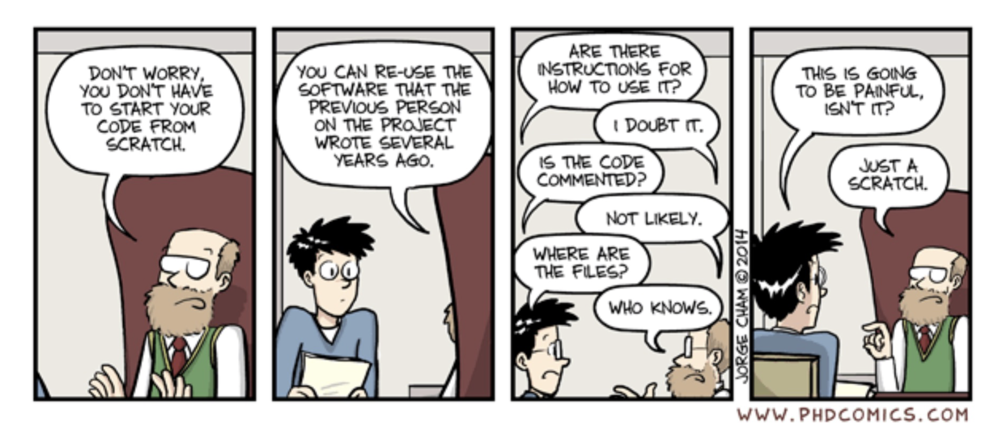

# Lesson 00 - Computational Statistics - Brief motivational introduction

## Computational Statistics vs Statistical Computing

> “Computational statistics is what statisticians do with the computer.”
> Naeve P. (2000)

**Statistical computing are computational methods that enable statistical methods.**

This may include:
- numerical analysis,
- database methodology,
- computer graphics,
- software engineering, and
- the computer/human interface.

- Computational statistics is somewhat more broad and includes not only the methods of statistical computing, but also statistical methods that are computationally intensive.
- Thus, to some extent, computational statistics refers to a large class of modern statistical methods.
- Computational statistics is grounded in mathematical statistics, statistical computing, and applied statistics.

> Computational Statistics
> “Computational statistics is a branch of mathematical sciences concerned with efficient methods for obtaining numerical solutions to statistically formulated problems.”
> Nickel C. (2020)

## Computational Statistics in Data Science

- Data science is an interdisciplinary field about scientific methods, processes and systems to extract knowledge or insights from data, generally referring to inductive generation of rules from large data sets.
- Computational statistics is the computational solution of statistical problems. It can be loosely described as traditional statistics using computers.
- Data science often employs methods of computational statistics, which is arguably its most important subset. However, computational statistics is not much found in the corporate world (there are not many jobs with this description).

## A course on computational statistics

This unit aims at providing students with knowledge, abilities and behaviours which may allow the use of intensive computational methods in statistical analysis.

Specifically, students are expected to:
- identify modern computational methods used in statistics, including methods: for simulation, estimation and visualization of statistical data
- acknowledge the role of computation as a tool for health data analysis
- be able to appropriately apply computational methodologies in real world health data science problems.

An introduction to the statistical programming language R will be presented as part of the course and students will be required to complete their assignments in R.

**Computational Statistics**
- Why computation in statistics?
- Tools and software for computational statistics
- Computational statistics using big data infrastructures

**Data Synopses**
- Sufficient Statistics
- Histograms
- Micro-Clusters
- Fading Statistics

**Density Estimation**
- Maximum Likelihood
- Expectation-Maximization
- Kernel Estimation

**Estimation and Simulation**
- Jackknife Methods
- Cross Validation
- Random Number Generation
- Monte Carlo Methods
- Bootstrap Methods

**Numerical analysis**
- Complex Data Visualization
- Principal component analysis
- Bivariate smoothing
- Splines

## Example of Computational Statistics in Data Science

In data mining activities models need to be properly evaluated to assess their generalizability. In such cases, computational statistics cames to help.

For that, researchers need to:
**ESTIMATION - Estimate models from raw data**
- e.g. distribution of Portuguese demographic characteristics
**SUMMARY STATISTICS - Compute sufficient statistics from data to allow human data inspection**
- e.g. create micro-clusters and visualise them
**RANDOM SAMPLING - Randomly selecting subsets of the data set**
- e.g. bootstrap and cross-validation
**ITERATIVE PROCESS - Iterate over a long learning process**
- e.g. gradient descent in deep learning structures
**MULTIPLE COMBINATIONS - Perform sensitivity analysis to initial conditions**
- e.g. perform multiple runs with different model parameters, k in k-NN

In cost-effectiveness studies it is hardly the case where we can put a global health policy in place to measure the long-term effects. In such cases, Markov models with Monte Carlo simulations are often needed.

For that, researchers need to:
**ESTIMATION - Estimate distribution parameters from previous studies**
- e.g. distributions of Portuguese prevalence of demographic characteristics
**RANDOM GENERATION - Generate random samples from estimated distributions**
- e.g. simulate 11M Portuguese people to be subject of health policy
**RANDOM GENERATION - Randomly deciding on occurrence of events**
- e.g. assign diagnoses or treatment results to single individuals in the current year
**ITERATIVE PROCESS - Iterate over a long follow-up period**
- e.g. study mortality rates in the 11M simulated cases during 30 years
**MULTIPLE COMBINATIONS - Perform sensitivity analysis to initial conditions**
- e.g. perform multiple simulations with different initial distributions parameters

## Software Tools for Computational Statistics
