# Lesson 01 - Data Synopses - Keeping (just) the necessary data

## Introduction

> **Wealth of Health Data**
> “The routine operation of modern healthcare systems produces a wealth of data in electronic health records, administrative databases, clinical registries, and other clinical systems.”
> Peek & Rodrigues (2018)

> **Raw Data**
> “The convergence of computing and communication has produced a society that feeds on information. Yet most of the information is in its raw form: data.”
> Witten & Frank (2000)

> **Knowledge Discovery**
> “It is widely acknowledged that there is great potential for utilizing these routine data for health research to derive new knowledge about health, disease, and treatments.”
> Peek & Rodrigues (2018)

> **Problems with data**
> “There are a lot of small data problems that occur in big data. They do not disappear because you have got lots of the stuff. They get worse.”
> Spiegelhalter D (2014)

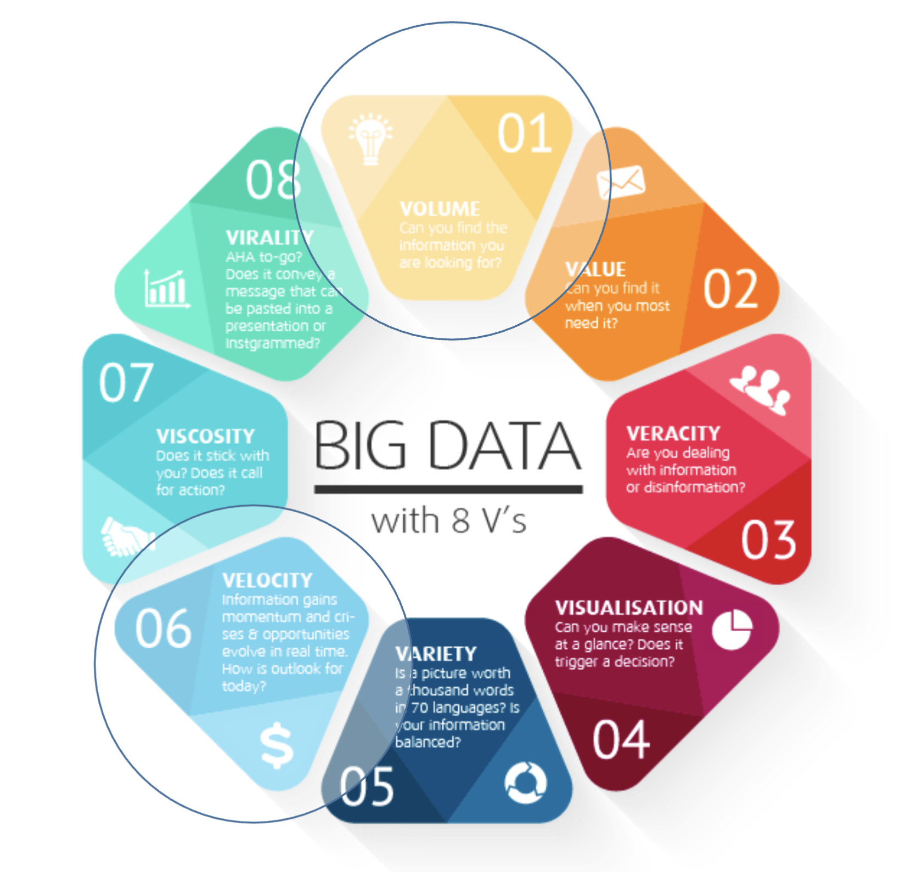

> **Data Synopses**
> “Snippets of data that allow more complex, yet efficient, computations.”
> Rodrigues P. P. (2020)

## Data Streams

> **Data Streams**
> “Many sources produce data continuously. These continuous flows of data are called data streams.”
> Muthukrishnan S. (2005)

**Data Streams vs Data Sets**
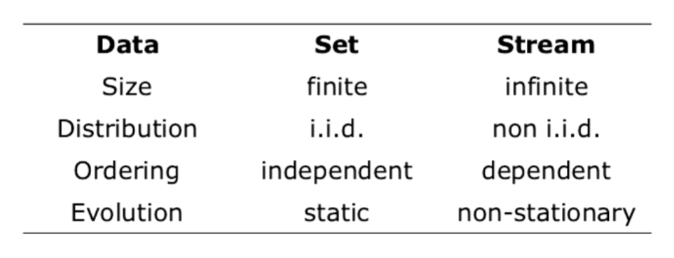
Gama J. & Rodrigues P.P. (2007)

> **Processing and Learning from Data Streams**
> “In these settings, traditional machine learning algorithms are obsolete.”
> Gama J., Sebastião R. & Rodrigues P.P. (2013)

**Learning from Data Streams**

Algorithms that learn from data streams:
- must process examples at the rate they arrive
- use a single scan and fixed memory
- maintain a decision model at any time
- adapt to the most recent data
- might end-up with approximate results

**Data Stream Models**

Different data stream models exist:
- insert-only or time series model
- once an observation x is produced, it cannot be changed
- insert-delete or turnstile model
- observations x can be deleted or updated
- accumulative or cash-register model
- each observation x is an increment to a sum X(t) = X(t-1) + x

**Data Stream Management**
> “The main issue in data streams are blocking operators, i.e. queries that require the entire input to be available before they can give an exact output.”
> Gama J. & Rodrigues P.P. (2007)

**Illustrative example**

Find the maximum value in a sliding window over a sequence of numbers.
- When we can store in memory all the elements of the sliding window, the problem is trivial and we can find the exact solution.
- When the size of the window is greater than the available memory, there is no algorithm that provides an exact solution!

**Open Research Questions**
- Approximate query processing techniques to evaluate queries that require an unbounded amount of memory.
- Sliding window query processing, both as an approximation technique and as an option in the query language.
- Sampling to handle situations where the flow rate of the input stream is faster than the query processor.
- The meaning and implementation of blocking operators (e.g., aggregation and sorting) in the presence of unending streams.

**Simple Counting Problems**
- Given a stream of bits (0’s and 1’s), maintain a count of the number of 1’s in the last N elements seen from the stream.
- Given a stream of elements that are positive integers in the range [0, . . . , R], maintain at every instance the sum of the last N elements seen from the stream.
- Find the number of distinct values in a stream of values with domain [1,...,N].

All these problems have an exact solution if we have enough memory to store all the elements in the sliding window. That is, the exact solution requires O(N) space.

Suppose we have restricted memory.
How can we solve these problems using less space than O(N)?

**Approximate Computations**
Approximate answers are useful if the associated error is in an admissible boundary.
We can define the approximation methods in the data streams as:

(ε,δ)-approximation schema
Given any positive number ε < 1 and δ < 1 compute an estimate that,with probability 1 − δ, is within relative error ≤ ε.

Time and space required to compute an answer depends on ε and δ.
Trade-off: summary size vs approximation error.

**Statistical Inequalities**

An estimator is a function of the observable sample data that is used to estimate an unknown population parameter. We are particularly interested in interval estimators that compute an interval for the true value of the parameter associated with a confidence 1 − δ.

Two types of intervals are:
- Absolute approximation: X − ε ≤ μ ≤ X + ε, where ε is the absolute error; and
- Relative approximation: (1 − δ)X ≤ μ ≤ (1 + δ)X, where δ is the relative error.

supp reading: Gama J. & Rodrigues P. (2007) “Data Stream Processing”, in Learning from Data Streams, Springer Verlag.

## Sufficient Statistics

For most computations, basic statistics suffice:
- counts
- sums
- sums of squares

### Central Tendency
Recursive computation of the sample mean:
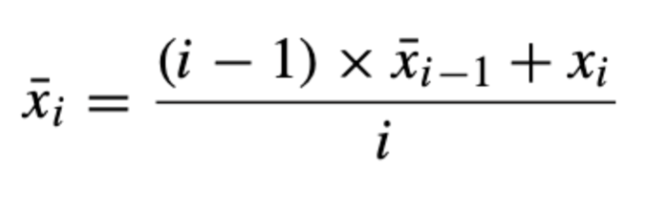
In fact, to incrementally compute the mean of a variable, we need only to maintain in memory the number of observations and the sum of the values seen so far.

### Dispersion
Simple mathematics allow us to define an incremental version of the standard deviation:
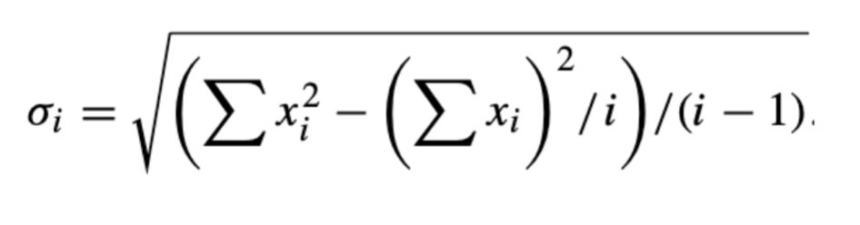
In that case we need to store three quantities: the number of data points, the sum of data points, and the sum of squares of the data points.

### Correlation
Another useful measure that can be recursively computed is the correlation coefficient:
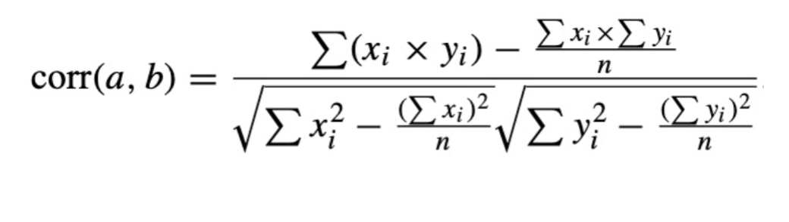
Given two streams x and y, we need to maintain the sum of each stream, the sum of the squared values, and the sum of the cross-product.

### Incrementing counters

Incrementing counters can be seen as a sum over a stream of 0’s and 1’s, where:
- each 1 represents a hit in the counter, and
- each 0 represents a miss.

This analogy will be extremely important later.

Counters are useful for other statistics computations, but also have their own value, e.g. maintaining histograms and micro-clusters.

### 2-dimensional stream
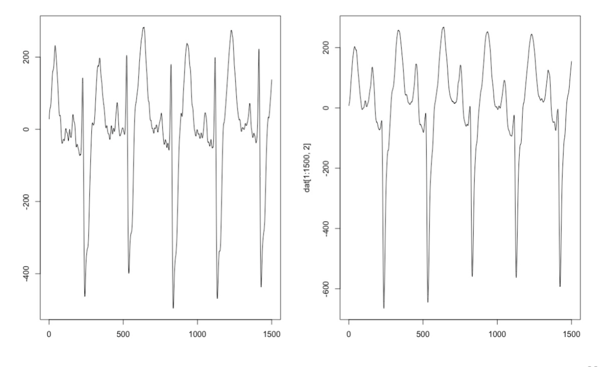

### Histograms

Histograms are distribution representations of individual continuous variables.

- The domain of the variable is divided into contiguous intervals.
- Each interval keeps a counter of the number of data points that fall in it.

Intervals might be defined by width (equal-width histograms) or number of points (equal-frequency histograms).

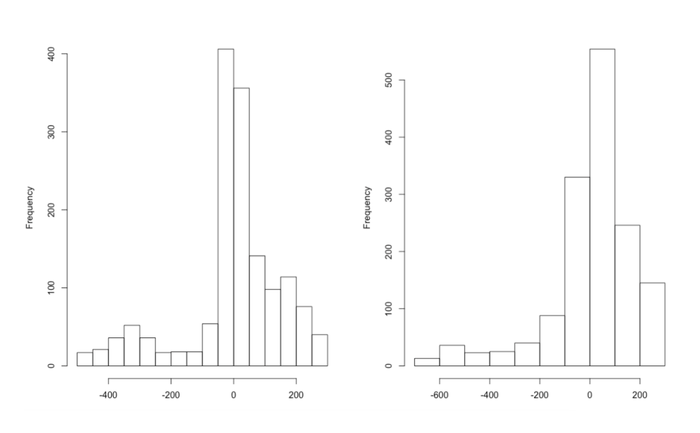

### Micro-Clusters

Micro-clusters are simplified representations of dense regions of the data space.
- Most commonly defined by n-dimensional grid cells.
- Each cell keeps a counter of the number of data points that fall in it
- A micro-cluster is a grid cell whose counter exceeds a certain threshold.

Cells might be defined by width (equal-width cells) or number of points (equal-frequency cells).

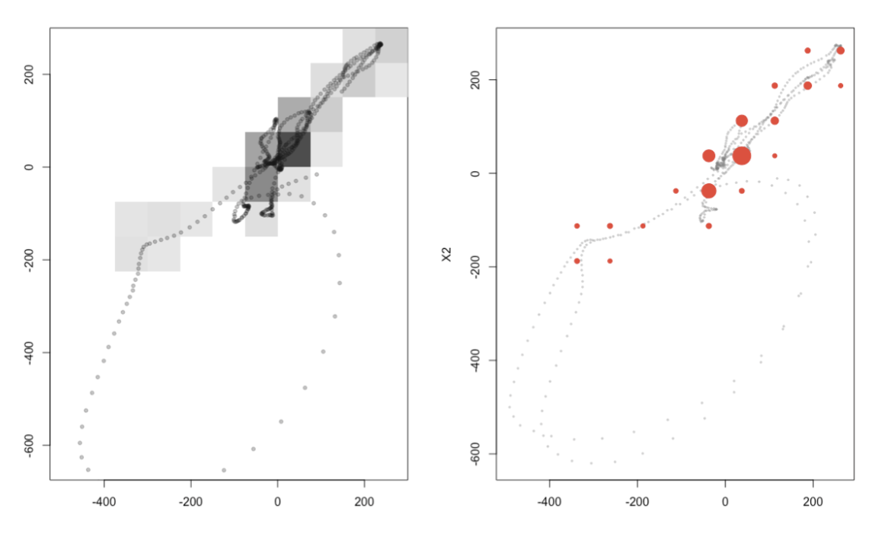

### Other statistics

Quantiles, median and other statistics used in range queries can be computed from histograms, and other summaries.
But, in most applications recent data is the most relevant one.
To fulfil this goal, a popular approach consists of defining a time window covering the most recent data.

### Windows

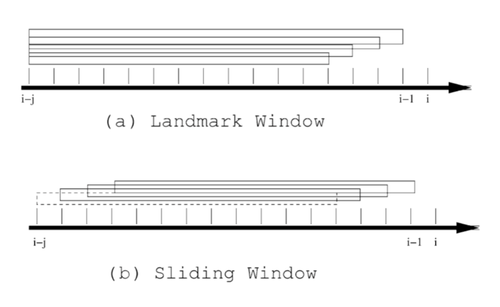

**Problems with time windows**
- Suppose we want to maintain the standard deviation of the values of a data stream using only the last 100 examples, that is in a fixed time window of dimension 100.
- After seeing observation 1000, the observations inside the time window are x901,...,x1000and the sufficient statistics are
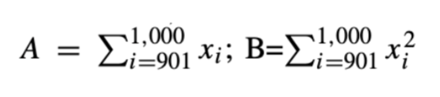
- Whenever the 1,001thvalue is observed, the time window moves 1 observation, forgets observation 901 and the updated sufficient statistics are:
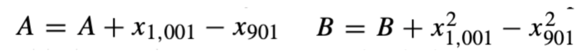
- Due to the necessity to forget old observations, we need to maintain in memory all the observations inside the window. The same problem applies for time windows whose size changes with time.

### Sampling

- Sampling involves loss of information: some tuples are selected for processing while others are skipped.
- If the rate of arrival data in the stream is higher than the capacity to process data, sampling is used as a method to slow down data.
- Another advantage is the use of offline procedures to analyse data, eventually for different goals.
- Nevertheless, sampling must be done in a principled way in order to avoid missing relevant information.

### Reservoir Sampling

The classic algorithm to maintain an online random sample:
- The basic idea consists of maintaining a sample of size s, called the reservoir.
- As the stream flows, every new element has a certain probability of replacing an old element in the reservoir.

Sampling is a general method for solving problems with huge amounts of data, and has been used in most streaming problems. The literature contains a wealth of algorithms for computing quantiles and distinct counts using samples. However, negative results exist for uniform sampling, mostly for queries involving joins.

As a matter of fact, sampling works by providing a compact description of much larger data.

Alternative ways to obtain compact descriptions include data synopsis.

## Data Synopsis

Multiple data synopses exist in literature:
- Frequency moments
- Hash sketches
- Exponential histograms
- Wavelets

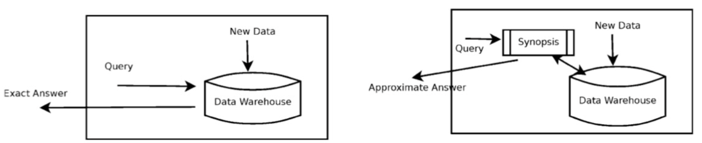

## Catastrophic Forgetting

However, most simple methods use a catastrophic forget, that is, any past observation either is inside the window or it is not inside the window.

- Usually in streaming settings, the concept generating data evolves smoothly, so old data is less but still important.
- Even within the sliding window, the most recent data point is usually more important than the last one which is about to be discarded.

A simple approach considers giving weights to data points depending on their age within the sliding window.
- Several weighting models could apply: linear, loglinear, etc.
- Given its particular characteristics, we will present an exponential approach.

### Alpha-weighed moving window

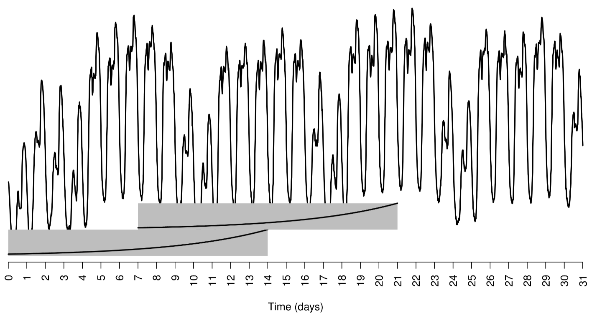

The main advantages of the α-weighted window are twofold:
- compared to traditional sliding windows, more importance is given to recent data points;
- compared to other weighting approaches, it can be maintained on the fly:
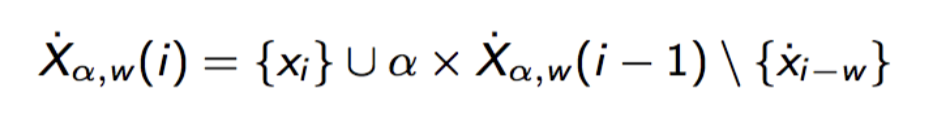

#### Alpha-weighed statistics

The α-weighted increment is
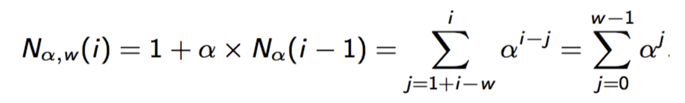
The α-weighted sum is
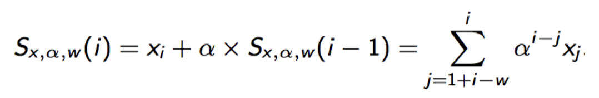
The α-weighted average is
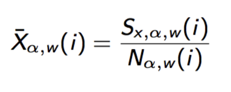

## Comparison

Approximates a small sliding window (better adaptation); keeps information from older data (smooth behaviour).

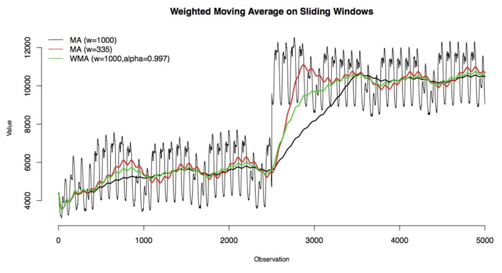

# GO ON FROM SLIDE 51